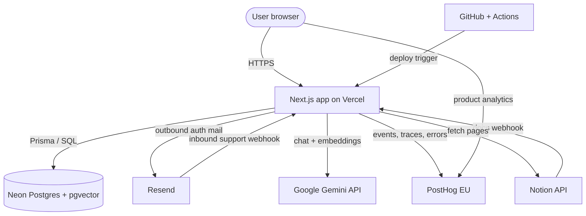

# Service landscape

Reference sheet for every paid or potentially-paid service this application talks to. Each section lists the current tier, what the free
allowance buys, and how the next tier is priced so budget projections can be made without re-researching each vendor.

# Service map

| Service                      | Role                                          | Current plan                     | Free allowance                                                     | First paid tier             | Metering                                                       |
| ---------------------------- | --------------------------------------------- | -------------------------------- | ------------------------------------------------------------------ | --------------------------- | -------------------------------------------------------------- |
| Neon                         | Postgres + pgvector (prod)                    | Free                             | 0.5 GB storage, ~191 compute-hrs/mo, autosuspend, 1 project        | Launch $19/mo               | Compute-hours ($/CU-hr) + storage $/GB-month + egress          |
| Resend                       | Outbound auth mail + inbound support webhook  | Free                             | 3,000 emails/mo · 100/day · 1 verified domain                      | Pro $20/mo (50k emails)     | Per-email overage (~$1 / 1,000 extra)                          |
| Google Gemini API            | Chat replies + embeddings                     | Free tier (AI Studio key)        | Rate-limited RPM/RPD per model; data may be used to improve models | Paid tier (Cloud billing)   | Per 1M input / output tokens, per model                        |
| PostHog                      | Product analytics, error tracking, LLM traces | Free (EU cloud)                  | 1M events, 5k session recordings, 1M flag req, 100k exceptions /mo | Pay-as-you-go               | Per-event, per-recording, per-exception, per-LLM-trace overage |
| Notion API                   | Documentation source (webhook + page fetch)   | Free (API on any workspace plan) | API access included; workspace plan separate                       | Workspace: Plus $10/user/mo | No metered API billing — cost is the workspace seat            |
| GitHub                       | Source control + OAuth provider               | Free                             | Unlimited public repos, 2,000 Actions min/mo (private)             | Team $4/user/mo             | Actions minutes + storage overages                             |
| GitHub Actions               | CI: lint, build, test, format, docs           | Included in GitHub Free          | 2,000 Linux min/mo on private repos; unlimited on public           | Per-minute overage          | $0.008/min Linux · 2× macOS · 10× Windows                      |
| Better Auth + better-auth-ui | Email/password + GitHub OAuth                 | Self-hosted (OSS)                | No SaaS cost — runs in our Next.js process                         | —                           | Infra cost only (DB rows, function time)                       |
| ngrok (optional, local)      | HTTPS tunnel for Notion/Resend webhook dev    | Free                             | Random hostname, 1 online tunnel, limited requests/min             | Personal $8/mo              | Reserved domain + higher limits per seat                       |

# Detail by category

## Platform & runtime

### Vercel — Hobby

Next.js 16 target host. Hobby is **not permitted for commercial use**, so the moment Dégage ships publicly this moves to Pro.

- Hobby includes: 100 GB bandwidth/mo, 100 GB-hr function duration, 1M edge requests, non-commercial only, no password-protected previews, no
  SSO.
- Pro pricing: $20/user/month base. Included: 1 TB fast data transfer, 1M function invocations, 1k GB-hr duration, 1M edge requests, ISR.
  Overages are itemised and billed per unit (bandwidth ~$0.15/GB, function duration per GB-s of CPU, image optimisations per 1k, etc.). Biggest
  gotcha: a runaway bot or unbounded SSR endpoint inflates function-duration charges quickly.

Docs: [Vercel pricing](https://vercel.com/pricing) · [Managing usage](https://vercel.com/docs/pricing/manage-and-optimize-usage) ·
[Next.js on Vercel](https://vercel.com/docs/frameworks/nextjs).

### Neon

Primary database in production; local dev uses the pgvector Docker image. pgvector lives inside the same Postgres, so embedding search has no
separate vendor.

- Free tier: 0.5 GB storage, ~191 compute-hours/mo (one 0.25 CU branch), autosuspend after ~5 min idle, 1 project, 10 branches. Fine for preview
  environments, insufficient for a business app with warm latency requirements.
- Launch $19/mo: includes 10 GB storage and 300 compute-hours. Beyond that: compute billed per compute-unit-hour (CU-hr ≈ $0.16 on Launch,
  proportional to CU size), storage at ~$0.35/GB-mo, egress free up to a threshold then per GB. Scale ($69/mo) and Business ($700/mo) raise the
  included quotas and add features (PITR window, logical replication, HIPAA).

Docs: [Neon pricing](https://neon.tech/pricing) · [Plans & billing](https://neon.com/docs/introduction/plans) ·
[Compute & autoscaling](https://neon.com/docs/introduction/autoscaling).

## AI & content

### Google Gemini API

Used in two places: support reply generation (via the Vercel AI SDK) and documentation embeddings.

- Free tier (AI Studio key): low RPM/RPD per model, prompts and completions may be used to improve Google models — not acceptable for
  confidential user content at scale. The moment the key is attached to a Cloud billing account, the tier flips to paid and training opt-out
  applies.
- Paid pricing (per 1M tokens, indicative list prices — verify the exact model id in code):

| Model                             | Input | Output |
| --------------------------------- | ----: | -----: |
| Gemini 2.5 Flash                  | $0.30 |  $2.50 |
| Gemini 2.5 Pro (≤200k ctx)        | $1.25 | $10.00 |
| Gemini 2.5 Flash-Lite             | $0.10 |  $0.40 |
| text-embedding / gemini-embedding | $0.15 |      — |

Cost driver is output tokens on support replies, not embeddings. Budget by modelling avg reply length × monthly conversations; embeddings are
effectively rounding.

Docs: [Gemini API pricing](https://ai.google.dev/pricing) · [API overview](https://ai.google.dev/gemini-api/docs) ·
[Data use & privacy](https://ai.google.dev/gemini-api/terms).

### Notion API

Consumed by the documentation webhook to ingest pages. Auth is an internal integration token; payloads are HMAC-verified.

- Notion does not meter the API. The only cost is the workspace plan that hosts the docs: Free for personal use, Plus $10/user/mo (billed
  annually) or $12 month-to-month, Business $20/user/mo, Enterprise quote-based. Webhooks and page fetches are included on every plan.
- Practical implication: the cost of Notion-as-CMS is "one editor seat", not per-request. The bottleneck is rate limit (≈3 req/s average), not
  price.

Docs: [Notion pricing](https://www.notion.com/pricing) · [API reference](https://developers.notion.com/reference/intro) ·
[Webhooks](https://developers.notion.com/reference/webhooks).

## Messaging & identity

### Resend

Outbound Better-Auth verification/reset mails and the inbound support webhook. Templates keyed per locale.

- Free: 3,000 emails/mo, **100/day** — the daily cap is usually what breaks first, not the monthly. 1 verified domain, broadcast audiences
  capped, no custom return-path.

| Plan       |  Price | Includes                                        |
| ---------- | -----: | ----------------------------------------------- |
| Pro        | $20/mo | 50k emails, unlimited domains, priority support |
| Scale      | $90/mo | 100k emails, dedicated IP option                |
| Enterprise |  quote | SLA, sub-processor addendum                     |

Overage: ~$1 per extra 1,000 emails on Pro. Inbound receiving is included on paid tiers once the domain has MX pointed at Resend.

Docs: [Resend pricing](https://resend.com/pricing) · [Sending email](https://resend.com/docs/send-with-nodejs) ·
[Inbound email](https://resend.com/docs/dashboard/emails/inbound).

### Better Auth + GitHub OAuth

Better Auth is an OSS library embedded in the Next.js server — no SaaS dependency, no per-MAU pricing. User/session/account rows live in our own
Postgres. Social login uses GitHub OAuth, which is free for any public OAuth app.

Cost scales with database rows and email delivery (see Neon and Resend). If user volume grows, the watchpoints are **session table growth** and
verification-email throughput (the 100/day Resend cap).

Docs: [Better Auth docs](https://www.better-auth.com/docs) · [better-auth-ui](https://better-auth-ui.com/) ·
[GitHub OAuth apps](https://docs.github.com/en/apps/oauth-apps/building-oauth-apps/creating-an-oauth-app).

## Observability

### PostHog (EU cloud)

Four separate products billed independently on one account: product analytics, session replay, error tracking, and LLM analytics. The LLM pipe
is wired via OpenTelemetry and the Vercel AI SDK's telemetry hooks, so every support reply emits an `$ai_generation` event with tokens and cost.

| Product                     |          Free / mo | Overage pricing                              | Notes                                                                  |
| --------------------------- | -----------------: | -------------------------------------------- | ---------------------------------------------------------------------- |
| Product analytics (events)  |          1,000,000 | ~$0.00005 / event (sliding down with volume) | Autocapture can explode this count — check event volume before launch. |
| Session replay              |   5,000 recordings | ~$0.005 / recording                          | Disable on admin/internal routes to avoid paying for own use.          |
| Feature flags / experiments | 1,000,000 requests | Per-request, tiered                          | Server-side flag evaluation reduces count.                             |
| Error tracking              | 100,000 exceptions | ~$0.0004 / exception (tiered)                | Source-map upload only on Vercel builds with PostHog API key set.      |
| LLM analytics               |   Billed per trace | ~$5 / 1,000 traces                           | Each AI SDK call = 1 trace; batching prompts reduces this.             |
| Data warehouse / surveys    |   Small free pools | Per-row / per-response                       | Not currently in use here.                                             |

Practical cost model: until the product hits ~1M autocaptured events/month, PostHog stays free except for LLM traces, which start charging from
the first paid trace. If support chat ramps, LLM analytics usually becomes the first line item — often before events do.

Docs: [PostHog pricing](https://posthog.com/pricing) · [Product analytics](https://posthog.com/docs/product-analytics) ·
[LLM observability](https://posthog.com/docs/ai-engineering/observability) · [Error tracking](https://posthog.com/docs/error-tracking).

## CI/CD & developer tooling

### GitHub + Actions

Five workflows — `build`, `docs`, `format`, `lint`, `test` — run on every PR. The URL validation workflow (`docs`) also runs on a schedule.

- Free Linux minutes: 2,000/mo on private repos, unlimited on public. The repo is private, so the cap matters. At ~5 workflows × ~2 min avg × N
  PRs/month, we stay well inside 2,000 minutes until PR volume is heavy.
- Overage: $0.008/min on Linux, $0.08/min macOS, $0.08/min Windows. GitHub Team ($4/user/mo) raises the pool to 3,000 minutes and adds code
  owners / required reviewers.

Docs: [GitHub pricing](https://github.com/pricing) ·
[About billing for Actions](https://docs.github.com/en/billing/managing-billing-for-your-products/managing-billing-for-github-actions/about-billing-for-github-actions).

### Local dev — Docker, DBGate, ngrok

Docker Desktop is free for individuals/small business; mid-size commercial use requires a Business plan. DBGate runs alongside as a local DB
explorer.

ngrok free tier is fine for occasional webhook testing but issues a random subdomain on each start, so the webhook URL must be re-registered.
Personal $8/mo gets a reserved domain; Pro $20/mo adds higher request rate and more endpoints.

Docs: [Docker pricing](https://www.docker.com/pricing) · [DBGate](https://dbgate.org) · [ngrok pricing](https://ngrok.com/pricing).

# Projection scenarios

Order-of-magnitude monthly run-rate — use as a sanity check, not a quote. Assumes EU region pricing and no reserved commitments.

| Scenario                                                         |  Vercel |   Neon | Resend |   Gemini |  PostHog | GitHub CI |    Total / mo |
| ---------------------------------------------------------------- | ------: | -----: | -----: | -------: | -------: | --------: | ------------: |
| Dev today (team of 1)                                            |      €0 |     €0 |     €0 |     €0–5 |       €0 |        €0 |     **~€0–5** |
| Soft launch (10k MAU, 2k emails, ~50 AI replies/day)             |     $20 |    $19 |    $20 |   $10–25 |    $0–10 |        $0 |   **~$70–95** |
| Growth (100k MAU, 30k emails, 1k AI replies/day, autocapture on) | $50–150 | $40–80 | $20–40 | $150–400 | $100–300 |     $0–15 | **~$360–985** |

# Risk notes

- **Vercel commercial clause.** Hobby cannot host a commercial product. Migration to Pro is a plan switch, not a redeploy — but budget
  $20/user/mo as a hard floor once Dégage opens to paying members.
- **Neon autosuspend latency.** On the free tier a cold start adds ~500 ms to the first request after idle. Acceptable in dev, visible in prod —
  Launch keeps the compute warm within the included compute-hours.
- **Gemini training opt-out.** Free-tier prompts may be logged by Google. Until a billing account is attached (or traffic is self-routed through
  Vertex AI), do not send PII or signed user documents through the support reply path.
- **PostHog autocapture amplification.** A single poorly-scoped autocapture config can 10× event volume overnight. Keep the PostHog project
  token unset in staging, or define explicit pageview capture and disable autocapture.
- **Resend daily cap.** 100 emails/day on Free. Onboarding + password reset traffic during a launch campaign can hit that in a single afternoon;
  move to Pro before any announced release.
